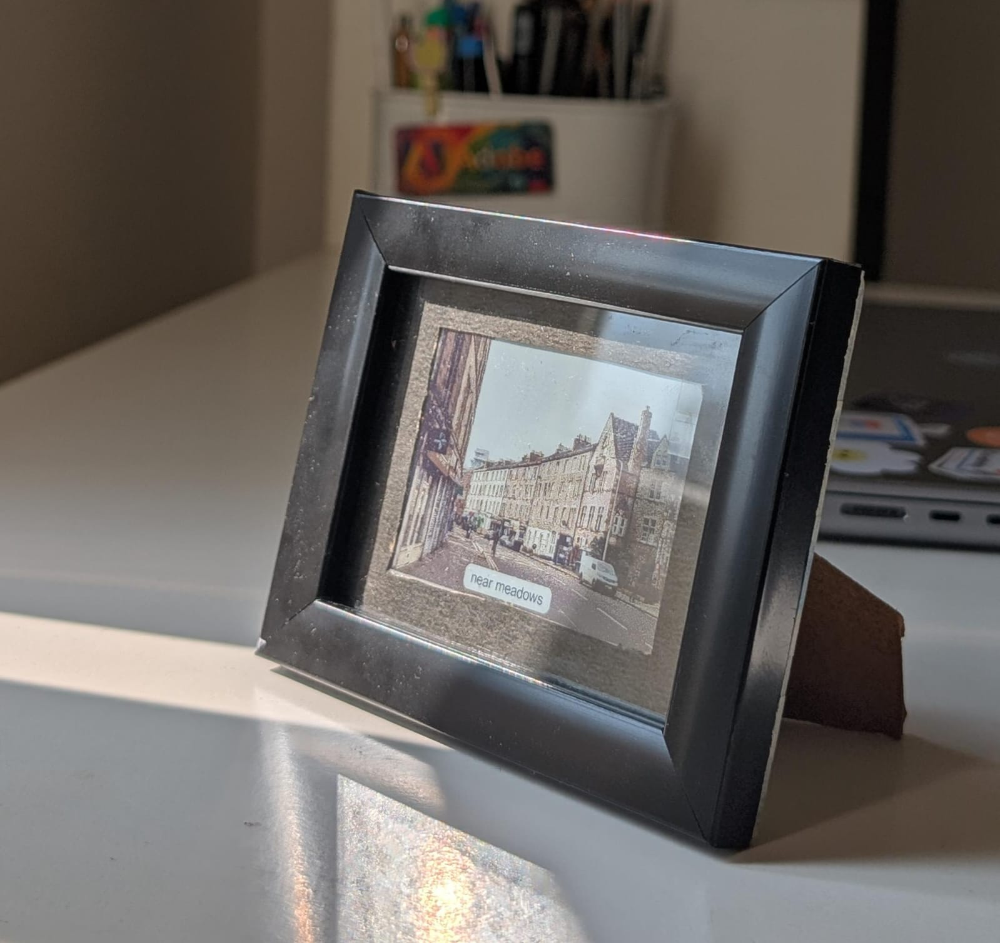
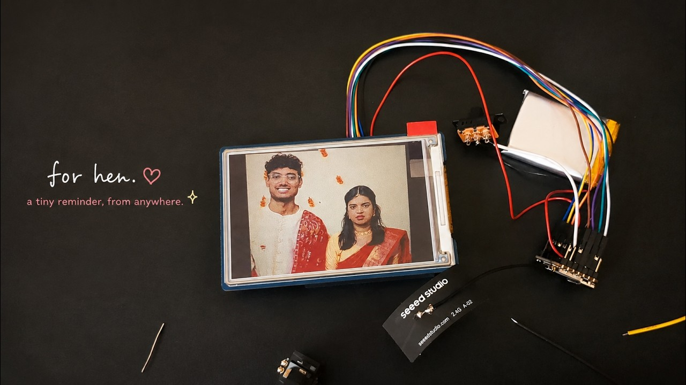

# Keep

A little e-paper frame for sharing everyday moments across distance.

<p align="center">
  
</p>

I built Keep for my long-distance fiancée. A photo taken on the small camera, or chosen on a phone, becomes a quiet image on the frame at the other end. The idea is to make being part of each other's day feel a little more tangible.

**[Watch the story and build on YouTube](https://youtu.be/kkhD97BJ-2o)**

[](https://youtu.be/kkhD97BJ-2o)

## How it works

```text
XIAO camera or phone photo
          ↓
Android app: choose, preview, send
          ↓
FastAPI server: store photo and make a six-colour e-paper frame
          ↓
Receiver XIAO: fetch latest frame → Waveshare e-paper display
```

The app also shows the shared gallery and can put the latest photo on an Android home-screen widget. The receiver can refresh on a button press or a daily schedule.

## Current state

Keep is a working personal prototype. This repository contains the Android app, image server, and firmware that drive the framed display. The photo above shows the finished frame; the video thumbnail shows the earlier wired build.

The camera's physical capture button and offline photo queue are still future work. The run commands below cover the app and server; firmware needs a board-specific build.

## Repository

| Path | What is in it |
| --- | --- |
| [`app/`](app/) | Flutter Android app, photo capture, gallery, and widget |
| [`server/`](server/) | FastAPI API and six-colour image processing |
| [`firmware/taruns_module/`](firmware/taruns_module/) | XIAO ESP32S3 Sense camera firmware |
| [`firmware/monishas_module/`](firmware/monishas_module/) | XIAO receiver and Waveshare 3.6-inch e-paper firmware |

## Run the app and server

The server needs Python and the app needs Flutter with an Android device or emulator. From the repository root:

```bash
cd server
python3 -m venv .venv
source .venv/bin/activate
pip install -r requirements.txt
KEEP_TOKEN=local-test-token uvicorn app:app --host 127.0.0.1 --port 8400
```

In another terminal:

```bash
cd app
flutter pub get
flutter run \
  --dart-define=KEEP_SERVER_URL=http://10.0.2.2:8400 \
  --dart-define=KEEP_SERVER_TOKEN=local-test-token
```

`10.0.2.2` is the Android emulator's route to the host machine. For a physical phone, bind the server to a reachable network interface and use that machine's LAN address. The [receiver firmware](firmware/monishas_module/main.cpp) needs its own server URL and token at build time.

The server's original and processed image URLs are currently public. Use test photos when running it outside a trusted network until those routes have access control.
